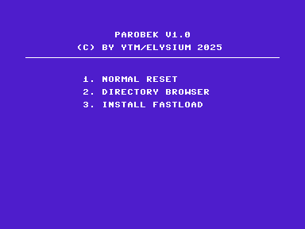

# Plus/4 "Parobek" ROM

**Parobek** is a multi-fast-loader utility ROM for the Commodore 16/116/Plus4 family.  
It automatically selects the fastest available transfer method for the attached drive and can also fall back to the original KERNAL routines when needed.

*Parobek* means *hired farmhand*. It's a pun on C128's [The Servant](https://github.com/ytmytm/c128-theservant-sd2iec). Parobek is simple and unsophisticated, but gets the work done.

---

## 1  Features

Works from any ROM bank (internal, external C1 or C2).

The function key is correctly registered and depends on the ROM's location. Function key
starts the embedded Directory Browser.

The ROM image is **32 KB** (`$8000–$FFFF`) – suitable for a 27C256 EPROM or equivalent EEPROM.



### 1.1 Fastloaders

#### 1570/1571/1581

Requires the [Burstcart](https://github.com/ytmytm/plus4-burstcart) interface.

**Burst fastloader** for 1570/1571/1581 – uses C128-style fast serial over the SRQ line with hardware shift register. Code based on the [original burst loader for C64](https://a1bert.kapsi.fi/Dev/burst/) by **Pasi Ojala**.

#### 1541 with parallel cable

Loader supports PPI (8255) / PIO (6529) interfaces (software handshake) and VIA (6522) / CIA (6526) [Burstcart](https://github.com/ytmytm/plus4-burstcart) interface (hardware handshake).

Loader is based on **SpeedDOS parallel loader** based on C64 code. There is another loader option (disabled by default) based on **[Port-Turbo-V1](https://plus4world.powweb.com/software/Port-Turbo_V1)**.

With hardware handshake and **[1541-RAMBOardII](https://github.com/ytmytm/1541-RAMBOardII)** drive-side RAM/ROM expansion for quicker GCR decoding and whole track data cache, the operation is even faster.

#### 1551

1551 drive loader based on **[HypaLoad v4.7](https://plus4world.powweb.com/software/Hypaload_1551)**, patched to work with both device numbers: #8 and #9

#### TCBM2SD

The **[TCBM2SD fastloader](https://github.com/ytmytm/plus4-tcbm2sd)** works with both device numbers #8 and #9 for ultimate speed.

### 1.2 Utilities

#### DOS Wedge

New commands:

| Command | Description |
|---------|-------------|
| `@` | Display current drive status |
| `@8` | Change current device number (e.g. `@9` or `@12`) |
| `$` | List directory of the current drive |
| `/` | Fast load a file (also works by placing `/` in front of a filename listed by `$` and pressing **RETURN**) |
| `←` | Save the BASIC program or memory image |

#### Directory Browser

Integrated Directory Browser works with and without fastloader present for maximum compatibility.

---

## 2  Building the ROM

### 2.1 Prerequisites

* [**ACME** cross-assembler](https://github.com/meonwax/acme)
* GNU `make` (optional – for the convenience target)

### 2.2 Quick Build

From the `src` directory:

```sh
cd src
make
```

The resulting binaries are written to `src/bin/`.

### 2.3 Configuration

Correct fastloader is autodetected, except for fast serial one. This is configured by setting the `burst` variable on top of the `burstcart.asm` file to one of possible values (VIA=2 is default):

```
; 1=CIA, 2=VIA, 3=CPLD
!set burst=2
```

---

## 3  Startup Menu

1. **Normal reset** – boots straight to BASIC without any cartridge hooks.
2. **Directory browser** – starts the browser **without** installing fastloaders.
3. **Enable fastload** – installs fastloader and DOS wedge; the directory browser becomes available on the registered function key (key depends on the ROM bank where Parobek is located).

---

## 4  Credits & Acknowledgements

Full development notes are available in [`docs/burstc64.txt`](docs/burstc64.txt).

Hardware input courtesy of the Plus/4 World community ([plus4world.powweb.com](https://plus4world.powweb.com)). 