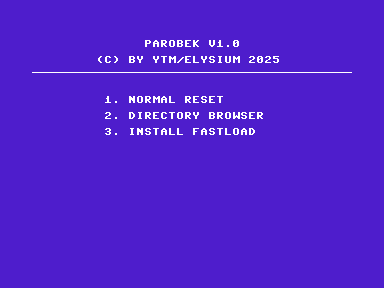

# Plus/4 "Parobek" ROM

**Parobek** is a multi-fast-loader utility ROM for the Commodore 16/116/Plus4 family.  
It automatically selects the fastest available transfer method for the attached drive and can also fall back to the original KERNAL routines when needed.

*Parobek* means *hired farmhand*. It's a pun on C128's [The Servant](https://github.com/ytmytm/c128-theservant-sd2iec). Parobek is simple and unsophisticated, but gets the work done.

---

## 1  Features

Works from any ROM bank (internal, external C1 or C2).

The function key is correctly registered and depends on the ROM's location. Function key
starts the embedded Directory Browser.

The ROM image is **32 KB** (`$8000–$FFFF`) – suitable for a 27C256 EPROM or equivalent EEPROM.



Warning: there are problems when Parobek is installed more than once (e.g. as internal function ROM and again on C1) so please avoid that.

For instance, do not put it on a 32KB ROM that goes into tcbm2sd - it would appear both as C1 and again on C2.

### 1.1 Fastloaders

Parobek picks a path per load from what is attached. On **IEC**, the order is **fastest first**, then fall through until one path handles the file (or KERNAL ROM load). On-screen text after `IEC DEVICE, ` shows which path won.

#### IEC selection order (fallbacks)

| Step | Condition | Path (message) |
|------|-----------|----------------|
| 1 | 1570/1571/1581 + Burstcart SRQ hardware | Burst (`VIA` / `CPLD BURST`, …) |
| 2 | Status contains `SD2IEC`, stock host kernal, datasette not blocking SJL | SJL264 (`SD2IEC, SJL264`) |
| 3 | 1541 with parallel cable | Parallel SpeedDOS (`1541/PARALLEL`) |
| 4a | Status contains `JIFFYDOS`, stock host, datasette not blocking | SJL264 (`SJL264`) |
| 4b | Host kernal is JiffyDOS | Host JD ROM load (`HOST JIFFYDOS…`); no Parobek SJL / no DOS wedge |
| 5 | stock 1541, datasette not blocking | JiffyDOS sender + SJL receiver (`1541 SERIAL`) |
| 6 | Nothing above handled the load | KERNAL (`ROM LOAD`) |

Notes:

- A connected **datasette** blocks only CPU-port bitbang paths (**SJL264** and **1541 SERIAL**). Burst and parallel still run.
- **Host JiffyDOS**: LOAD hook stays (burst / TCBM / parallel still useful); Parobek skips SJL and does not install its DOS wedge.
- **TCBM / 1551** are chosen earlier on the TCBM bus path, not via this IEC table.

#### 1570/1571/1581 (Burst)

Requires the [Burstcart](https://github.com/ytmytm/plus4-burstcart) interface.

**Burst fastloader** – C128-style fast serial over the SRQ line with a hardware shift register. Based on the [original burst loader for C64](https://a1bert.kapsi.fi/Dev/burst/) by **Pasi Ojala**.

#### IEC JiffyDOS / SD2IEC (SJL264)

When the drive status contains `SD2IEC` or `JIFFYDOS` (and the host is not already JiffyDOS), Parobek uses an **SJL264**-derived serial fastloader: cycle-timed 2-bit CLK/DATA receive on the Plus/4 CPU port, ROM-safe (no self-mod).

At install, Parobek probes the host CPU port once and stores **`cpu_port_type`** in the LOAD trampoline (same lifetime as the rest of the install RAM). That value selects how SJL receives:

- **8501** (stock Plus/4 CPU): existing receive loop; a connected datasette still blocks this path.
- **Hackjunk 6510 + patched KERNAL** ([8501→6510 conversion](https://hackjunk.com/2017/06/23/commodore-16-plus-4-8501-to-6510-cpu-conversion/)): a second receive loop, with DATA in bit 0 and CLK in bit 5. The cassette motor gate does not apply.
- **6510 + stock KERNAL** (and unknown ports): SJL is skipped; the load falls through to ROM IEC.

**Sources / references**

- Upstream: [SJL264 Light](https://bsz.amigaspirit.hu/sjl264/index_en.html) (BSZ) — load-only path ported into `src/sjl-loader*.asm`; reference tree under `third_party/sjl264/`
- C64 background: [SJLOAD](https://www.c64-wiki.com/wiki/SJLOAD) / JaffyDOS

#### Stock 1541 serial (`1541 SERIAL`)

For a stock 1541 **without** parallel and **without** drive JiffyDOS/SD2IEC, Parobek uploads drive code that speaks the same JiffyDOS LOAD bit timing, then receives with the shared **`SJL_jd_transfer`** entry (same loop as SJL264). CLK/DATA only — no ATN-as-data.

Host handling is the same `cpu_port_type` value set at install:

- **Hackjunk 6510 + patched KERNAL**: same second receive loop as SJL264 (DATA in bit 0, CLK in bit 5). Cassette motor gate does not apply.
- **6510 + stock KERNAL**: this path is skipped; the load uses ROM IEC.

**Sources / references (drive sender)**

- Disassembled 1541 JiffyDOS LOAD routines: [`docs/1541EJD.a65`](docs/1541EJD.a65) (from [Ruud Baltissen’s source codes](http://www.baltissen.org/newhtm/sourcecodes.htm)
- Protocol notes: [Open ROMs — Protocol-JiffyDOS](https://github.com/MEGA65/open-roms/blob/master/doc/Protocol-JiffyDOS.md), [pagetable 2-bit transfer](https://www.pagetable.com/?p=568)

#### 1541 with parallel cable

Loader supports PPI (8255) / PIO (6529) (software handshake) and VIA (6522) / CIA (6526) [Burstcart](https://github.com/ytmytm/plus4-burstcart) (hardware handshake).

Based on **SpeedDOS parallel loader** (C64-derived). Alternate option (disabled by default): **[Port-Turbo-V1](https://plus4world.powweb.com/software/Port-Turbo_V1)**.

With hardware handshake and **[1541-RAMBOardII](https://github.com/ytmytm/1541-RAMBOardII)** drive-side RAM/ROM (faster GCR / track cache), loads are even faster.

#### 1551

Based on **[HypaLoad v4.7](https://plus4world.powweb.com/software/Hypaload_1551)**, patched for devices #8 and #9 and two-way handshake.

#### 1551 with RAMBOard

Loosely based on **[HypaLoad v4.7](https://plus4world.powweb.com/software/Hypaload_1551)** with **[1551-RAMBOard](https://github.com/ytmytm/1551-RAMBOard)** whole-track cache — about 7× stock 1551 / 27× stock 1541.

Same protocol as the 1551 fastloader; needs a RAMBOard-patched drive ROM (`RAM` at `$a000`, jumptable at `$a003`). Devices #8 and #9.

#### Load performance

Baseline **1×** = stock KERNAL **ROM LOAD** (~470 B/s) — the slowest path in the matrix (stock 1581, no fastloader). That matches the ~440 B/s class of a plain serial load; on a 1541 the `.d64` interleave matters (smoke disk uses the default **9**; interleave **6** would be optimal for JiffyDOS, but the test image is not tuned for that).

| Configuration | B/s | vs ROM load |
|---------------|----:|------------:|
| 1581 stock (KERNAL ROM load) | 474 | 1× |
| 1541 stock (1541 SERIAL) | 873 | 1.8× |
| 1541 + parallel PIO | 1858 | 3.9× |
| 1541 + parallel PIO + RAMBOard | 1885 | 4× |
| 1551 + RAMBOard RAM | 1919 | 4× |
| 1551 HypaLoad | 1925 | 4.1× |
| 1541 + parallel VIA | 1933 | 4.1× |
| 1541 JiffyDOS (SJL264) | 2191 | 4.6× |
| 1581 JiffyDOS (SJL264) | 3279 | 6.9× |
| 1541 + parallel VIA + RAMBOard | 3851 | 8.1× |
| 1581 JiffyDOS + BurstCart VIA | 4652 | 9.8× |
| 1581 + BurstCart CPLD | 4663 | 9.8× |
| 1581 + BurstCart VIA | 4695 | 9.9× |
| 1551 HypaRAM | 5424 | 11× |

#### TCBM2SD

The **[TCBM2SD fastloader](https://github.com/ytmytm/plus4-tcbm2sd)** works on devices #8 and #9 for ultimate speed on the TCBM bus.

### 1.2 Utilities

#### DOS Wedge

New commands:

| Command | Description |
|---------|-------------|
| `@` | Display current drive status |
| `@8` | Change current device number (e.g. `@9` or `@12`) |
| `$` | List directory of the current drive |
| `/` | Fast load a file (also works by placing `/` in front of a filename listed by `$` and pressing **RETURN**) |
| `←` | Save the BASIC program or memory image |
| `@Q` | Disable fastloader, re-enable with computer reset |

#### Directory Browser

Integrated Directory Browser works with and without fastloader present for maximum compatibility.

---

## 2  Building the ROM

### 2.1 Prerequisites

* [**ACME** cross-assembler](https://github.com/meonwax/acme)
* GNU `make` (optional – for the convenience target)

### 2.2 Quick Build

From the `src` directory:

```sh
cd src
make
```

The resulting binaries are written to `src/bin/`.

### 2.3 Configuration

Correct fastloader is autodetected, except for fast serial one. This is configured at ROM assembly step by setting the `burst` variable on top of the `burstcart.asm` file to one of possible values (VIA=2 is default):

```
; 1=CIA, 2=VIA, 3=CPLD
!set burst=2
```

---

## 3  Startup Menu

1. **Normal reset** – boots straight to BASIC without any cartridge hooks.
2. **Directory browser** – starts the browser **without** installing fastloaders.
3. **Enable fastload** – installs fastloader and DOS wedge; the directory browser becomes available on the registered function key (key depends on the ROM bank where Parobek is located).

---

## 4  Credits & Acknowledgements

Full development notes can be found in [`docs/burstc64.txt`](docs/burstc64.txt).

Hardware insights provided by the Plus/4 World community ([plus4world.powweb.com](https://plus4world.powweb.com)).